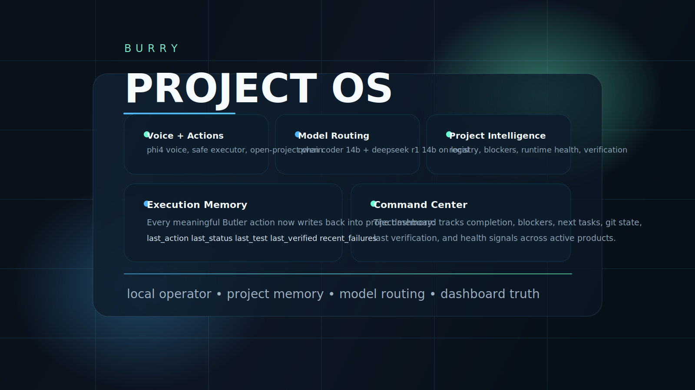
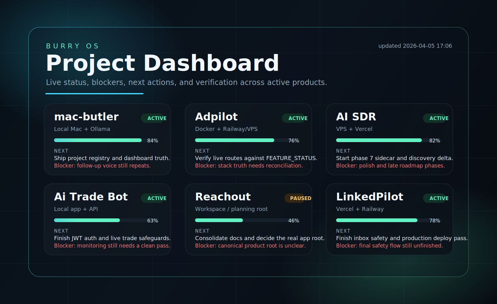
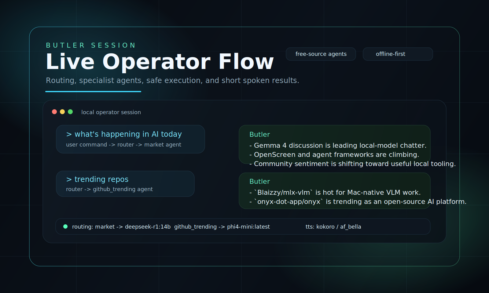

<p align="center">
  
</p>

<p align="center">
  <strong>Local project OS for real work.</strong>
</p>

<p align="center">
  Burry is building a local-first operator layer around active projects, model routing,
  execution, memory, dashboard truth, and live machine context.
</p>

<p align="center">
  <a href="#what-burry-is">What It Is</a> •
  <a href="#inside-this-repo">Inside This Repo</a> •
  <a href="#what-works-now">What Works Now</a> •
  <a href="#run-it-locally">Run It Locally</a> •
  <a href="#repo-map">Repo Map</a>
</p>

## What Burry Is

Burry is not a chat wrapper.

It is an operator system that sits on top of real projects and tries to answer the practical
questions that matter while you are working:

- What should I do next?
- Which project is active right now?
- What is blocked?
- Which model should handle this task?
- What happened after the action ran?
- What is happening in AI right now?

The main product in this repo is [`mac-butler`](mac-butler): a local Mac operator that reads
project state, routes actions, speaks through a local voice, runs tools safely, and writes the
results back into memory.

## Product Views

<p align="center">
  
</p>

<p align="center">
  <em>Project OS dashboard with live project state, blockers, progress, and next actions.</em>
</p>

<p align="center">
  
</p>

<p align="center">
  <em>Butler session flow: command, routing, specialist agent output, and local operator response.</em>
</p>

## Inside This Repo

| Area | Purpose |
| --- | --- |
| `mac-butler/` | Core product: Butler runtime, agents, project OS, dashboard, memory, voice, tests |
| `assets/` | Public-facing visuals, hero banner, and product previews |
| `Butler Vault/` | Local notes and private operating memory kept outside the public product surface |
| `README.md` | GitHub landing page for the whole Burry system |

## What Works Now

### Core System

- Project OS with tracked products, progress, blockers, next steps, health, and verification
- Fuzzy `open_project` flow with real editor fallback behavior
- Local model routing across planning, review, search, coding, and voice roles
- Safe executor for app opens, project opens, shell commands, reminders, music, notes, and URLs
- Project memory write-back after execution
- Dark dashboard for active projects and next actions
- Kokoro local TTS with macOS fallback

### Live Intelligence

- Hacker News agent using the public Firebase API
- Reddit signal agent using public subreddit JSON feeds
- GitHub trending agent using free public GitHub trending data
- Market pulse agent that aggregates free signals first, then summarizes them
- Free-source fallback flow when local search is offline

### Verified Commands

These are live flows that work now:

- `open adpilot`
- `what should i do next`
- `open dashboard`
- `what's happening in AI today`
- `what's on hackernews`
- `what's reddit saying`
- `trending repos`
- `check vps`
- `git status`
- `play mockingbird`

## Current Runtime Shape

### Operator Pipeline

```text
Machine Context
    -> Intent Router
    -> Specialist Agent or Planner
    -> Safe Executor
    -> Memory Write-Back
    -> Dashboard / Voice Response
```

### Active Local Roles

| Role | Current Model |
| --- | --- |
| Voice | `phi4-mini:latest` |
| Planning | `qwen2.5-coder:14b` |
| Review / Search / Market | `deepseek-r1:14b` |
| Hacker News / Reddit / Trending | `phi4-mini:latest` |
| Coding / GitHub / VPS | `qwen2.5-coder:14b` |

## Run It Locally

```bash
cd mac-butler
./setup.sh
bash scripts/start_searxng.sh
venv/bin/python projects/dashboard.py
venv/bin/python butler.py --test
```

Useful checks:

```bash
cd mac-butler
venv/bin/python projects/github_sync.py
venv/bin/python projects/open_project.py adpilot
venv/bin/python -m unittest discover -s tests -v
```

If you want the full operator detail, configuration, and action surface, read
[`mac-butler/README.md`](mac-butler/README.md).

## Repo Map

```text
Burry/
├── assets/
│   ├── burry-banner.svg
│   ├── dashboard-preview.svg
│   └── butler-session.svg
├── Butler Vault/
│   └── local operator notes and private memory
├── mac-butler/
│   ├── agents/        live specialist agents and delegated tooling
│   ├── brain/         model routing and planning logic
│   ├── context/       machine, editor, task, git, and project context
│   ├── executor/      safe action execution
│   ├── intents/       deterministic routing layer
│   ├── memory/        session memory and project write-back
│   ├── projects/      project registry, dashboard, GitHub sync, open flow
│   ├── tasks/         task storage
│   ├── tests/         regression suite
│   ├── voice/         TTS and STT
│   └── butler.py      main runtime entrypoint
└── README.md
```

## Why This Repo Exists

The point of Burry is to make local AI useful for execution, not just conversation.

That means:

- project truth instead of generic memory
- routing instead of one-model-for-everything
- action safety instead of raw shell chaos
- write-back instead of forgotten output
- operator UX instead of chatbot theater

## Current Status

- Butler Project OS v1 is in place
- Live intelligence layer is wired with free public data sources
- Kokoro voice is live
- Dashboard and project open flows are working
- The main regression suite is green

## Roadmap

The next serious upgrades are:

- richer live conversation and follow-up handling
- stronger project health and deploy visibility
- deeper memory analysis of code-agent output
- cleaner project scoring from runtime signals
- broader repo polish across product docs and demos

## Notes

- `Butler Vault/` and local secret material are intentionally not part of the public product surface
- large model and voice runtime files stay ignored
- some local JSON state files change during active development and are not part of the public story
